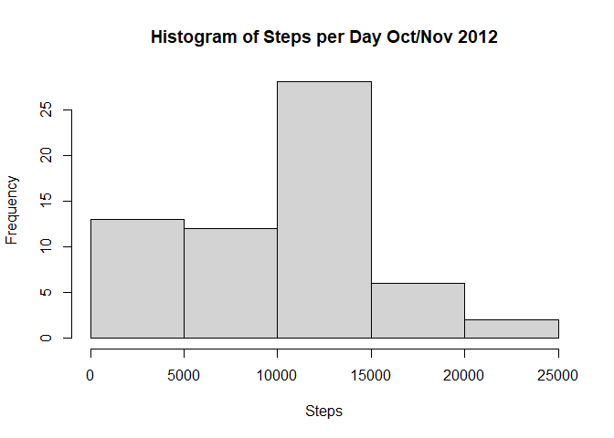
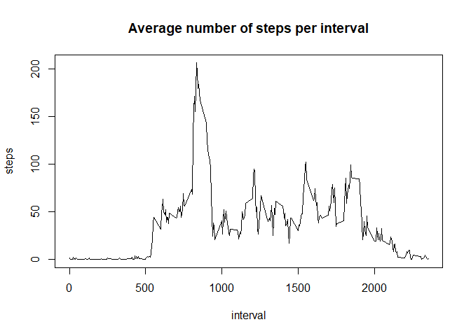
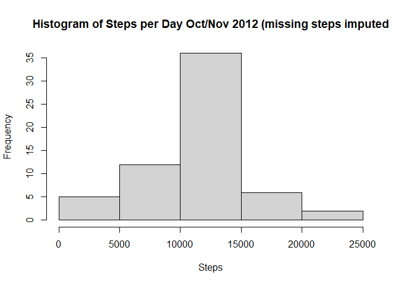
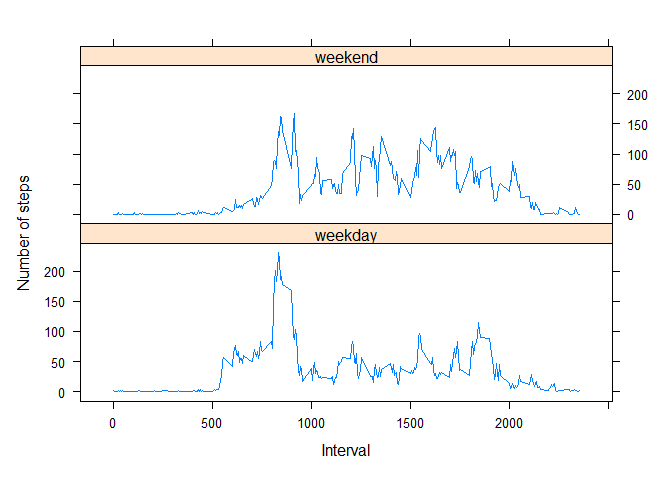

Reproducible Data - Project 1 
=============================

read in data


```r
  data <- read.csv("activity/activity.csv")
  options(scipen=999, blogdown.method = "markdown")
```

Calculate total number of steps per day, ignore missing values. 


```r
  steps_per_day <- aggregate(data$steps, by = list(data$date), FUN = sum, na.rm = TRUE)
  names(steps_per_day) <- c("date","steps")
```

Make histogram of total number of steps taken per day


```r
  hist(steps_per_day$steps, xlab = "Steps", main = "Histogram of Steps per Day Oct/Nov 2012")
```

<!-- -->

Calculate the mean and median of the steps taken per day


```r
   mean_steps <- round(mean(steps_per_day$steps, na.rm = TRUE), digits = 0)
   median_steps <- median(steps_per_day$steps, na.rm = TRUE)
```

The mean number of steps per day is 9354. The median is 10395.

Time series plot of the 5 minute interval and steps taken per interval


```r
   steps_per_interval <- aggregate(data$steps, by = list(data$interval), FUN = mean, 
                                  na.rm = TRUE)
   names(steps_per_interval) <- c("interval", "steps")
   with(steps_per_interval, plot(interval, steps, type = "l", 
                                 main = "Average number of steps per interval"))
```

<!-- -->

```r
   max_steps <- max(steps_per_interval$steps)
   max_interval <- steps_per_interval$interval[steps_per_interval$steps == max_steps]
```

The interval with the maximum average number of steps is 835.

Inputing missing values

Count number of rows with na


```r
   rows_missing_step_data <- sum(as.numeric(is.na(data$steps)))
```

There are 2304 rows missing step data.

Imput the missing values. Use the previously calculated mean steps for the interval if a value is missing.


```r
  imputed_data <- as.data.frame(data)

  for (i in 1:nrow(imputed_data)) {
  if (is.na(imputed_data[i,]$steps)) {
    get_interval <- data[i,]$interval
    imputed_data[i,]$steps <-   
              round(as.numeric(steps_per_interval$steps[steps_per_interval$interval  
                                                       == get_interval]), digits = 0)
  }
}


max(imputed_data$steps)
```

```
## [1] 806
```

```r
check_rows_missing_step_data <- sum(as.numeric(is.na(imputed_data$steps)))
```
There are 0 rows missing data after imputing the data. 

Compute a histogram with imputed data. Compare to histogram without imputed data. 


```r
  imputed_steps_per_day <- aggregate(imputed_data$steps, by =    
                                      list(imputed_data$date), FUN = sum)
  names(imputed_steps_per_day) <- c("date","steps")
  hist(imputed_steps_per_day$steps, xlab = "Steps", main = "Histogram of Steps per Day Oct/Nov 2012 (missing steps imputed")
```

<!-- -->

```r
   imputed_mean_steps <- round(mean(imputed_steps_per_day$steps), digits = 0)
   imputed_median_steps <- median(imputed_steps_per_day$steps)
```

The mean number of steps with imputing is 10766 and without imputing is 9354.
The median number of steps with imputing is 10762 and without imputing is 10395.

Differences in activity patterns between weekdays and weekends


```r
    library(lattice)
    week_days <- c("Monday", "Tuesday", "Wednesday", "Thursday", "Friday")
    imputed_data$date <- factor(ifelse(weekdays(as.Date(imputed_data$date)) %in% 
                                          week_days, "weekday",  "weekend"))
    agg_data <- aggregate(steps ~ interval + date, imputed_data, mean)
      
  
    
    xyplot(steps ~ interval | date, agg_data, type ="l", layout = c(1,2), xlab = 
              "Interval", ylab = "Number of steps")
```

<!-- -->
